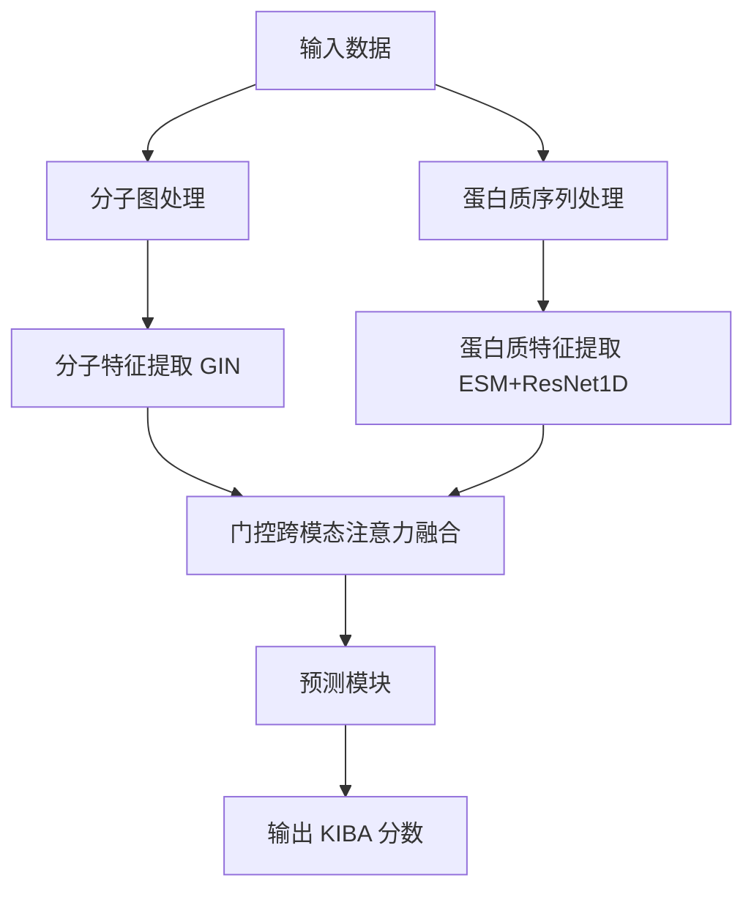

# DeepBindNet 项目文档

## 项目概述
DeepBindNet 是一个用于预测蛋白质-小分子结合亲和力的深度学习模型。本项目采用门控跨模态注意力机制，结合图神经网络(GIN)和蛋白质序列特征提取模块(ESM + ResNet1D)，实现了高效的蛋白质-小分子相互作用预测。

## 主要功能
1. 蛋白质-小分子结合亲和力预测
2. 跨模态特征融合
3. 模型训练与评估
4. 结果可视化

## 技术架构



## 数据预处理
1. 加载KIBA数据集
2. 使用ESM模型提取蛋白质序列特征
3. 使用RDKit将SMILES转化为分子图
4. 标准化KIBA分数
5. 划分训练/验证/测试集 (7:2:1)

## 模型架构

### 主要模块
1. **分子特征提取模块 (GIN)**
   - 输入特征：
     - 原子特征 (6维：原子类型、度数、形式电荷等)
     - 键特征 (3维：键类型、共轭、环信息)
   - 网络结构：
     - 5层GIN卷积
     - 隐藏层维度128
     - 最终特征维度256
     - Dropout率0.2

2. **蛋白质特征提取模块 (ESM + ResNet1D)**
   - 输入特征：
     - 蛋白质序列 (长度≤1024)
   - 处理流程：
     - ESM-1b模型提取序列特征 (1280维)
     - 4层ResNet1D (隐藏层64→128→256→512)
     - 全局最大池化
     - 最终特征维度256

3. **门控跨模态融合模块**
   - 核心结构：
     - 8头注意力机制
     - 2层Transformer编码器
     - 前馈网络维度1024 (256×4)
     - 注意力Dropout率0.2
   - 门控机制：
     - 动态权重分配
     - 跨模态信息过滤
     - 可解释性注意力权重

4. **预测模块**
   - 网络架构：
     - 全连接层 (256 → 128 → 1)
     - LayerNorm归一化
     - ReLU激活函数
     - Dropout率0.2
   - 输出处理：
     - 训练时输出标准化KIBA分数
     - 预测时自动反标准化
     - 支持原始值范围预测

## 训练参数配置
```python
# 模型参数
parser.add_argument('--hidden_dim', type=int, default=128,
                    help='GIN隐藏层维度')
parser.add_argument('--feature_dim', type=int, default=256,
                    help='最终特征维度')
parser.add_argument('--fusion_heads', type=int, default=8,
                    help='融合注意力头数')
parser.add_argument('--fusion_layers', type=int, default=2,
                    help='Transformer编码器层数')
parser.add_argument('--dropout_rate', type=float, default=0.2,
                    help='全局Dropout比率')

# 训练参数
parser.add_argument('--batch_size', type=int, default=128,
                    help='训练批大小')
parser.add_argument('--num_epochs', type=int, default=200,
                    help='最大训练轮数')
parser.add_argument('--lr', type=float, default=0.001,
                    help='初始学习率')
```

## 训练流程
1. 使用混合精度训练
2. 采用OneCycleLR学习率调度器
3. 早停机制 (patience=15)
4. 评估指标：
   - RMSE (均方根误差)
   - R2 (决定系数)
5. 模型保存：
   - 每5个epoch保存一次检查点
   - 保存最佳模型

## 文件结构
```
DeepBindNet/
├── data/
│   ├── KIBA.csv
│   └── processed/
│       ├── processed_data.pkl
│       ├── scaler_params.pkl
│       ├── train_data.pkl
│       ├── val_data.pkl
│       └── test_data.pkl
├── outputs_gated/
│   ├── logs/  # TensorBoard日志
│   ├── best_model.pt
│   └── test_results.pkl
├── model_gated.py  # 模型定义
├── preprocess.py   # 数据预处理
├── train_gated.py  # 训练脚本
├── visualize_training.py  # 可视化工具
└── ...  # 其他辅助文件
```

## 使用说明
1. 数据预处理
```bash
python preprocess.py
```

2. 模型训练
```bash
python train_gated.py \
    --data_dir data/processed \
    --output_dir outputs_gated \
    --batch_size 128 \
    --num_epochs 200 \
    --lr 0.001 \
    --mixed_precision
```

3. 结果可视化
```bash
python visualize_training.py --log_dir outputs_gated/logs
```
