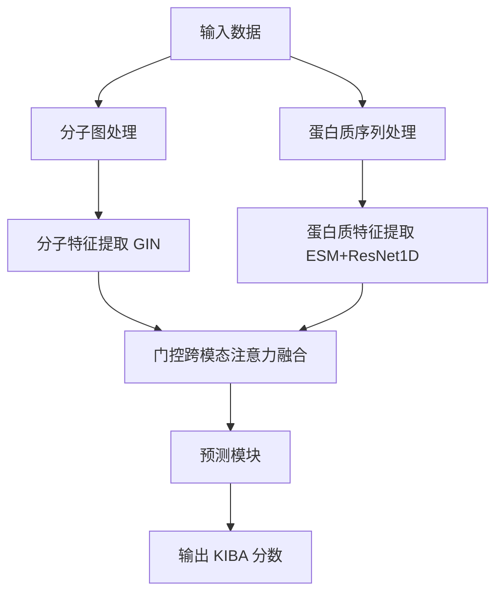

# DeepBindNet

DeepBindNet 是一个用于预测蛋白质-小分子结合亲和力的深度学习模型。本项目采用门控跨模态注意力机制，结合图神经网络(GIN)和蛋白质序列特征提取模块(ESM + ResNet1D)，实现了高效的蛋白质-小分子相互作用预测。

## 项目概述

DeepBindNet 通过创新的门控跨模态注意力机制，有效融合蛋白质序列和小分子结构信息，预测它们之间的结合亲和力。该模型在 KIBA 数据集上进行训练和评估，展现出优秀的预测性能。

## 主要特性

- **跨模态特征融合**：使用门控注意力机制融合蛋白质和小分子特征
- **高效特征提取**：
  - 使用 GIN 提取分子图特征
  - 使用 ESM-1b + ResNet1D 提取蛋白质序列特征
- **优化的训练流程**：
  - 混合精度训练
  - 学习率调度
  - 早停机制
- **全面的评估指标**：RMSE、R²等
- **可视化工具**：训练过程和预测结果可视化
- **批量预测支持**：支持多个蛋白质-小分子对的批量预测

## 技术架构



### 主要模块

1. **分子特征提取模块 (GIN)**
   - 5层GIN卷积
   - 隐藏层维度128
   - 最终特征维度256

2. **蛋白质特征提取模块 (ESM + ResNet1D)**
   - ESM-1b模型提取序列特征
   - 4层ResNet1D
   - 全局最大池化

3. **门控跨模态融合模块**
   - 8头注意力机制
   - 2层Transformer编码器
   - 动态权重分配

4. **预测模块**
   - 全连接层 (256 → 128 → 1)
   - LayerNorm归一化
   - ReLU激活函数

## 环境要求

- Python 3.8 或更高版本
- CUDA 11.3 或更高版本（用于 GPU 加速，推荐）
- 至少 8GB RAM
- 至少 10GB 磁盘空间（用于模型和数据）

## 安装指南

### 快速安装

使用自动化安装脚本：

```bash
# 使用默认设置（自动检测 CUDA）
python setup_environment.py

# 仅使用 CPU 版本
python setup_environment.py --cpu-only

# 指定 CUDA 版本
python setup_environment.py --cuda-version 11.3
```

### 手动安装

1. 创建并激活虚拟环境：

```bash
# 使用 conda
conda create -n deepbindnet python=3.9
conda activate deepbindnet

# 或使用 venv
python -m venv deepbindnet_env
# Windows 激活
deepbindnet_env\Scripts\activate
# Linux/Mac 激活
source deepbindnet_env/bin/activate
```

2. 安装 PyTorch（根据您的 CUDA 版本）：

```bash
# CUDA 11.3
pip install torch torchvision torchaudio --index-url https://download.pytorch.org/whl/cu113

# 或 CPU 版本
pip install torch torchvision torchaudio
```

3. 安装 PyTorch Geometric：

```bash
pip install torch-geometric
pip install torch-scatter torch-sparse torch-cluster torch-spline-conv -f https://data.pyg.org/whl/torch-{TORCH_VERSION}+{CUDA_VERSION}.html
```

4. 安装 RDKit：

```bash
conda install -c conda-forge rdkit
# 或
pip install rdkit
```

5. 安装 ESM：

```bash
pip install fair-esm
```

6. 安装其他依赖项：

```bash
pip install -r requirements.txt
```

详细的安装说明请参考 [INSTALLATION.md](./INSTALLATION.md)。

## 使用说明

### 数据预处理

```bash
python preprocess.py
```

### 模型训练

```bash
python train_gated.py \
    --data_dir data/processed \
    --output_dir outputs_gated \
    --batch_size 128 \
    --num_epochs 200 \
    --lr 0.001 \
    --mixed_precision
```

### 优化版训练

```bash
python train_optimized.py \
    --loss_type huber \
    --huber_delta 1.0 \
    --use_weighted_loss \
    --weight_type abs_diff \
    --weight_alpha 1.0
```

### 单个预测

```bash
python predict.py --smiles "CC1=C(C=C(C=C1)NC(=O)C2=CC=C(C=C2)CN3CCN(CC3)C)NC(=O)C4=CC=C(C=C4)F" --protein_sequence "MKKFFDSRREQGGSGLGSGSSGGGGSTSGLGSGYIGRVFGIGRQQVTVDEVLAEGGFAIVFLVRTSNGMKCALKRMFVNNEHDLQVCKREIQIMRDLSGHKNIVGYIDSSINNVSSGDVWEVLILMDFCRGGQVVNLMNQRLQTGFTENEVLQIFCDTCEAVARLHQCKTPIIHRDLKVENILLHDRGHYVLCDFGSATNKFQNPQTEGVNAVEDEIKKYTTLSYRAPEMVNLYSGKIITTKADIWALGCLLYKLCYFTLPFGESQVAICDGNFTIPDNSRYSQDMHCLIRYMLEPDPDKRPDIYQVSYFSFKLLKKECPIPNVQNSPIPAKLPEPVKASEAAAKKTQPKARLTDPIPTTETSIAPRQRPKAGQTQPNPGILPIQPALTPRKRATVQPPPQAAGSSNQPGLQNGLNVQKRKQELAGTLTAELEELKQAVPKEAGPGSQPQ"
```

### 批量预测

```bash
python batch_predict.py --input_csv sample_input.csv
```

### 结果可视化

```bash
python visualize_training.py --log_dir outputs_gated/logs
python visualize_predictions.py --results_file outputs/test_results.pkl
```

## 文件结构

```
DeepBindNet/
├── data/                      # 数据目录
│   ├── KIBA.csv               # 原始数据集
│   └── processed/             # 预处理后的数据
├── outputs_gated/             # 训练输出目录
│   ├── logs/                  # TensorBoard日志
│   ├── best_model.pt          # 最佳模型
│   └── test_results.pkl       # 测试结果
├── model_gated.py             # 门控模型定义
├── model.py                   # 标准模型定义
├── gin.py                     # GIN模块实现
├── protein_feature.py         # 蛋白质特征提取
├── fusion.py                  # 跨模态融合模块
├── loss_functions.py          # 损失函数实现
├── preprocess.py              # 数据预处理
├── train_gated.py             # 门控模型训练
├── train_optimized.py         # 优化版训练
├── predict.py                 # 单个预测
├── batch_predict.py           # 批量预测
├── visualize_training.py      # 训练可视化
├── visualize_predictions.py   # 预测结果可视化
├── requirements.txt           # 依赖项列表
├── setup_environment.py       # 环境设置脚本
└── README.md                  # 本文档
```

## 模型优化

DeepBindNet 提供了多种优化方案：

1. **模型架构优化**：
   - 减少 GIN 层数并添加残差连接
   - 优化蛋白质编码器
   - 增强跨模态融合能力

2. **回归优化**：
   - 替代损失函数 (Huber Loss, Log-Cosh Loss)
   - 样本加权机制
   - 预测结果可视化和分析

详细信息请参考：
- [README_optimization.md](./README_optimization.md)
- [README_regression_optimization.md](./README_regression_optimization.md)

## KIBA 分数解释

KIBA 分数是一种综合了 Ki、Kd 和 IC50 的标准化指标，用于衡量蛋白质-小分子结合亲和力：

- \> 12.0: 极强结合亲和力，非常可能有药理活性
- 8.0 - 12.0: 强结合亲和力，很可能有药理活性
- 6.0 - 8.0: 中等结合亲和力，可能有药理活性
- 4.0 - 6.0: 弱结合亲和力，药理活性有限
- < 4.0: 极弱结合亲和力，药理活性可能性低

## 文档参考

- [PROJECT_DOCUMENTATION.md](./PROJECT_DOCUMENTATION.md) - 详细的项目文档
- [INSTALLATION.md](./INSTALLATION.md) - 安装指南
- [DEPENDENCIES.md](./DEPENDENCIES.md) - 依赖项说明
- [README_INSTALLATION.md](./README_INSTALLATION.md) - 安装目录说明
- [README_prediction.md](./README_prediction.md) - 预测脚本使用指南
- [README_optimization.md](./README_optimization.md) - 模型优化实现
- [README_regression_optimization.md](./README_regression_optimization.md) - 回归模型优化方案

## 注意事项

1. 确保模型文件（`best_model.pt`）位于正确的目录中
2. 对于大型蛋白质序列，预测可能需要较长时间
3. 使用 GPU 可以显著加速预测过程
4. SMILES 字符串必须有效，否则会导致错误
